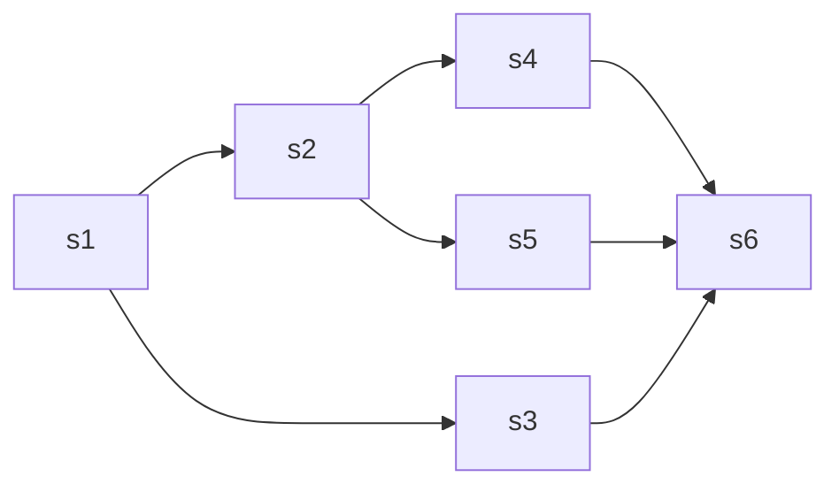

# 第四章 进程同步

## 1. 临界资源：一次仅允许一个进程使用的资源（打印机）

   对临界资源的访问必须互斥的进行 每个进程中 访问临界资源的那段代码被称为临界区

```cpp
   do {
      entry section;       // 进入区
      critical section;    // 临界区
      exit section;        // 退出区
      remainder section;   // 剩余区
   } while (true);
```

## 2. 同步：直接制约关系， 进程因为需要在某些位置上协调它们的工作次序而等待

   传递信息而产生的制约关系

## 3. 互斥：间接制约关系， 一个进程进入临界区使用临界资源时 另一个进程必须等待 当占用临界资源的进程退出临界区后，另一进程才被允许访问此临界资源

   为了禁止两个进程同时进入临界区，同步机制应当遵循如下准则：

1. 空闲让进 临界区空闲时 可以允许一个请求进入临界区的进程立即进入临界区
2. 忙则等待 当已有进程进入临界区时，其他视图进入临界区的进程必须等待
3. 有限等待 对请求访问的进程 应保证能在有限时间之内进入临界区
4. 让权等待 当进程不能进入临界区时 应立即释放处理器 防止进程忙等待

## 4. 实现临界区互斥的基本方法：

1. 软件实现方法： `Perterson's Algorithm` :

设置一个变量 $turn$ ，每个进程在先设置自己的标志后再设置 $turn$ 标志，这时再同时检测另一个进程状态标志和允许进入标志，以便保证两个进程同时要求进入临界区时，只允许一个进程进入临界区.
下面以两个进程 $0/1$ 为例

```cpp
      bool flag[2];
      bool turn;
      void Perterson(int i) {
         flag[i] = true;                  // 进入区
         const int j = i ^ 1;       
         turn = j;
         while (flag[j] && turn == j) {   // 进入区
            // wait...
         }
         critical section;                // 临界区
         flag[i] = false;                 // 退出区
         remainder section;               // 剩余区
      }
```

一旦 `flag[i] = true` 表示他想进入到临界区 此时 `turn = j` . 如果此时j已经在临界区里面，那么会跑到 `while (flag[i] && turn == j)` 里面
此时 `i` 不能顺利进入临界区；如果 `j` 不在临界区, 那么 `i` 会进入临界区

所以是用 `flag` 解决临界资源的互斥访问 利用 `turn` 解决饥饿现象

2. 硬件实现方法：

   1. 中断屏蔽方法:

      关中断;
      临界区;
      开中断;

3. 指令硬件方法 $TS$: $TestAndSet$ 指令 这是一条原子指令 功能是读出指定标志后把该标志设置为真

```cpp
      bool TestAndSet(bool* lock) {
         bool old = *lock;
         *lock = true;
         return old;
      }
```

使用该指令实现互斥的过程：为每个临界资源设置一个共享 $bool$ 变量 $lock$ , $lock$ 用来表示资源的两种状态, 初始为 $false$ . 在进入临界区之前, 用 $TestAndSet$ 检查 $lock$ 如果没有进程在临界区, 那么 $lock == false$ 可以进入, 关闭临界资源, 把 $lock$ 置为 $true$ 表示当前已经有进程在临界区里面, 让其他任何进程都不能进入临界区.
如果有进程在临界区, 则进行循环检查直到进程退出, 

```cpp
      while (TestAndSet(&lock)); 
      进程的临界区代码段...; 
      lock = false; 
      进程的其他代码段...; 
```

使用 $swap$ 指令实现互斥：：为每个临界资源设置一个共享 $bool$ 变量 $lock$ , $lock$ 用来表示资源的两种状态, 初始为 $false$ . 给每个进程在设置一个 $bool$ 变量 $key$ 用来与 $lock$ 交换信息, 在进入临界区之前 先利用 $swap$ 指令交换一下 $lock$ 和 $key$ 的内容, 然后check一下 $key$ 的状态, 如果有进程在临界区 那么就重复 $swap$ 过程. 直至有进程退出

```cpp
      bool key = true;
      while (!key) {
         swap(&lock, &key);
      }
      进程的临界区代码段...;
      lock = false;
      进程的其他代码段...;
```

## 5. 互斥锁：解决临界区问题最简单的就是互斥锁，一个进程在进入临界区获得锁，离开临界区释放锁。

每个互斥锁有一个 $bool$ 变量 $available$ 表示锁是否可用  
`acquire()` 获得锁; `release()` 释放锁 这两个都是原子操作

```cpp
   void acquire() {
      while (!available) {
         // 忙则等待
      }
      available = false; // 获得锁
   }
   void release() {
      available = true // 释放锁
   }
```

主要特点: 忙则等待, 

## 6. 信号量机制：只能被两个标准原语$wait(S)$ 和 $signal(S)$ 来访问 通常被记为 $P/V$ 操作

1. 整形信号量：

```cpp
      void wait(int S) { // P(S)
         while (S <= 0) {
            // wait... （*）
         }
         S--；
      }
      void signal(int S) { // V(S)
         S++;
      }
```

   （*） 这个位置只要 `S <= 0` 那就不断测试 所以不是让权等待 而是使得进程处于忙而等待的状态

2. 记录型信号量 增加了一个进程链表 `L` 用于连接所有等待该资源的进程
   记录型信号量表示为

```cpp
      struct semaphore{
         int value;
         PCB *list;
      };
```

   相应的 $wait$ 和 $signal$ 操作如下：
   1. $wait$ 操作 $S\rightarrow value--$ 表示请求一个该类资源, 当 $S\rightarrow value < 0$ 时, 表示该类资源已经分配完毕, 因此进程应当调用 $block$ 原语进行自我阻塞, 放弃处理机, 并插入该类资源的等待队列 $list$ 中. 该机制遵循了 **让权等待** 的原则
   2. $signal$ 操作 $S\rightarrow value++$ 表示释放一个该类资源. 当释放了一个资源, 加一之后仍然有 $S\rightarrow value \leq 0$ 时, 则表示 $S\rightarrow list$ 中仍有等待该进程的资源被阻塞, 因此应当调用 $wakeup$ 原语 把 $S\rightarrow list$ 中的第一个进程唤醒 

```cpp
      void wait(semaphore* S) { // 申请资源
         if (--S->value < 0) { // 该类资源分配完毕，自我阻塞放弃处理机
            block(S->list);
         }
      }
      // 这里wait 资源分配完毕 block自我阻塞 放弃处理机 让权等待
      void signal(semaphore* S) { // 释放资源
         if (++S->value <= 0) { // 
            wakeup(S->list); /* 该信号量链表中仍有等待该资源的进程被阻塞， 调用wakeup原语唤醒S->list的第一个进程 
            特别的 如果S->value 初始值为1 表示只允许一个进程访问临界资源，此时信号量会转化为互斥信号量
            */ 
         }
      }
      // signal释放资源 如果释放之后仍然阻塞那么调用wakeup原语 把S.L中第一个等待进程唤醒
```

1. 信号量实现同步： 设 $S$ 为 $P_1$ , $P_2$ 同步的公共信号量. $x$ 执行完之后 $y$ 才能执行

```cpp
semaphore S = 0;
process P1() {
   x;
   V(S);  // 告诉进程P2语句x已经完成
   ...
}
process P2() {
   ...
   P(S);  // check语句x是否完成
   y;
   ...
}
```

   如果 $P_2$ 先执行到 $P(S)$ 时 $S = 0$，执行 $P$ 操作会把进程 $P_2$ 阻塞，并放入阻塞队列   当进程 $P_1$ 中的 $x$ 执行完之后，执行 $V$ 操作 把 $P_2$ 从阻塞队列中放回就绪队列，当 $P_2$ 获得处理机时，就得以继续进行

4. 信号量实现互斥：

```cpp
semaphore mutex = 1; // 两个进程的互斥信号量初始化为1 表示只允许一个进程访问临界资源
process P1() {
   ...
   P(mutex);
   P1的临界区;
   V(mutex);
   ...
}
process P2() {
   ...
   P(mutex);
   P2的临界区;
   V(mutex);
   ...
}
```

5. 信号量实现前驱关系：建图，check前驱是否运行完成



```cpp
semaphore a1 = 0, a2 = 0, b1 = 0, b2 = 0, c = 0, d= 0, e = 0;
S1() {
   ...;
   V(a1);
   V(a2);
}
S2() {
   P(a1);
   ...;
   V(b1);
   V(b2);
}
S3() {
   P(a2);
   ...;
   V(c);
}
S4() {
   P(b1);
   ...;
   V(d);
}
S5() {
   P(b2);
   ...;
   V(e);
}
S6() {
   P(c);
   P(d);
   p(e);
   ...;
}
```

## 7. 管程：利用共享数据抽象地表示系统中的共享资源，使用管程进行管理

   每次只允许一个进程进入管程

```cpp
monitor Demo { // 管程名
   share variable S; // 共享变量
   cond condition; // 条件变量

public:
   void P1(...) {...}
   void P2(...) {...}
   void Pi(...) {...}
   ...
   { // 管程主体
      void init_code() { // 初始化代码
         S = 5;
      }
      void take_away() {
         S--;
         ...
      }
      void give_back() {
         S++;
         ...
      }
   }
};
```

1. 管程的特性：

   1. 模块化
   2. 抽象数据类型
   3. 信息掩蔽
2. 管程和进程的区别：

   1. 进程定义的是私有PCB 而管程定义的是共有数据结构 如消息队列等
   2. 进程是由顺序程序执行有关操作的，而管程则主要进行同步和初始化操作
   3. 进程实现并发， 管程解决资源之间的互斥使用问题
   4. 进程主动工作，管程被动工作
   5. 进程之间并发执行，管程则不能与调用者并发
   6. 进程具有动态性 动态的创建和撤销，而管程则是 `OS` 的一个资源管理模块, 仅供进程调用
3. 条件变量：阻塞原因 $condition$

   $x.wait$ : $x$ 的条件不满足时 正在调用管程的进程调用 $x.wait$ 将自己插入 $x$ 的等待队列，并且释放管程
   $x.signal$ : $x$ 对应的条件放生了变化, 调用 $x.signal$ 唤醒一个因为 $x$ 条件而阻塞的进程

   条件变量的定义：

```cpp
monitor Demo {
   dataStruct S;
   void init_code(){...}
   void take_away() {
      if (S <= 0) {
         w.wait();
      }
   }
   void give_back() {
      if (wait == true) {
         x.signal();
      }
   }
};
```

## 8. 同步问题：

1. 生产者-消费者问题：一组生产者进程和一组消费者进程共享一个初始为空、大小为 $n$ 的缓冲区，只有缓冲区没满时，生产者才能把消息放入缓冲区，否则必须等待；只有缓冲区不空时，消费者才能从中取出消息，否则必须等待。由于缓冲区是临界资源；它只允许一个生产者放入消息，或一个消费者从中取出消息。

```cpp
semaphore mutex = 1; // 记录当前临界区的互斥信号量
semaphore empty = n; // 记录当前满缓冲区数量
semaphore full = 0; // 记录当前空的缓冲区数量

void producer() {
   while (true) {
      produce an item in nextp; // 生产数据
      P(empty); // 获取空的缓冲区资源 空缓冲区数量--
      P(mutex); // 进入临界区, 占据互斥信号量
      add nextp to buffer // 行为, 将产生的数据放入缓冲区
      V(mutex); // 离开缓冲区, 释放互斥信号量
      V(full); // 产生一块满的缓冲区, 让满缓冲区数量++
   }
}

void consumer() {
   while (true) {
      P(full); // 获得一块满的缓冲区资源
      P(mutex); // 进入临界区, 占据互斥信号量
      get an item from the buffer // 行为 从缓冲区获取数据
      V(mutex); // 离开临界区, 释放互斥信号量
      V(empty); //  产生一块空的缓冲区, 让空缓冲区数量--
      consume the item; // 消费数据
   }
}
```

2. 水果问题：桌子上有一个盘子，每次只能向其中放入一个水果。爸爸专向盘子中放苹果，妈妈专向盘子中放橘子，儿子专等吃盘子中的橘子，女儿专等吃盘子中的苹果。只有盘子为空时，爸爸或妈妈才可向盘子中放一个水果；仅当盘子中有自己需要的水果时，儿子或女儿可以从盘子中取出

```cpp
semaphore plate = 1, apple = 0, orange = 0;
// plate 为互斥信号量, apple, orange分别表示盘子中是否有这两种水果
// dad 和 mom 是互斥关系
// dad 和 daughter 是 同步关系; mom 和 son 是同步关系
// daughter 和 son 没有互斥和同步关系, 因为它们选择条件执行
void dad() {
   while (true) {
      prepare an apple;
      P(plate); // 占据盘子
      put the apple on the plate;
      V(apple);
   }
}
void mom() {
   while (true) {
      prepare an orange;
      P(plate); // 占据盘子
      put the orange on the plate;
      V(orange);
   }
}
void son() {
   while (true) {
      P(orange);
      take an orange from the plate;
      V(plate);
      eat the orange;
   }
}
void daughter() {
   while (true) {
      P(apple);
      take an apple from the plate
      V(plate);
      eat the apple;
   }
}
```

3. 读者-写者问题: 有读者和写者两组并发进程，共享一个文件，当两个或以上的读进程同时访问共享数据时不会产生副作用，但若某个写进程和其他进程(读进程或写进程)同时访问共享数据时则可能导致数据不一致的错误。因此要求：①允许多个读者可以同时对文件执行读操作；②只允许一个写者往文件中写信息; ③任意一个写者在完成写操作之前不允许其他读者或写者工作；④写者执行写操作前，应让己有的读者和写者全部退出

```cpp
int count = 0; // 记录当前读者的数量
semaphore mutex = 1; // 用于保护更新count变量的互斥
semaphore rw = 1; // 保证读写进程互斥访问文件的锁
semaphore w = 1; // 写优先
void writer() {
   while (true) {
      p(w);
      P(rw);
      writing;
      V(rw);
      V(w);
   }
}
void reader() {
   while (true) {
      P(w); // 无写进程时请求进入
      P(mutex); // 互斥访问count
      if (++count == 1) P(rw); // 当第一个读进程度文件时, 它要阻止写进程写
      V(mutex); // 释放互斥变量count
      V(w); // 恢复对共享文件的访问
      reading;
      P(mutex);
      if (--count == 0) V(rw);// 当最后一个进程读完了文件, 才能允许写进程写
      V(mutex);
   }
}
```

4. 哲学家进餐问题：一张圆桌边上坐着5名哲学家，每两名哲学家之间的桌上摆一根筷子，两根筷子中间是一碗米饭，哲学家们倾注毕生精力用于思考和进餐，哲学家在思考时，并不影响他人。只有当哲学家饥饿时，才试图拿起左、右两根筷子(一根一根地拿起)。若筷子已在他人手上，则需要等待。饥饿的哲学家只有同时拿到了两根筷子才可以开始进餐，进餐完毕后，放下筷子继续思考
   **当且仅当哲学家左右两边的筷子都能用的时候才允许他抓起筷子(反向贪心)**

```cpp
constexpr int N = 5;
semaphore mutex = 1;
std::array<semaphore, N> chopstick;
chopstick.fill(1);
void P(int i) {
   do {
      P(mutex);
      P(chopstick[i]);
      P(chopstick[(i + 1) % 5]);
      V(mutex);
      eat;
      V(chopstick[i]);
      V(chopstick[(i + 1) % 5]);
      think;
   } while (true);
}
```

5. 吸烟者问题: 假设一个系统有三个抽烟者进程和一个供应者进程。每个抽烟者不停地卷烟并抽掉它，但要卷起并抽掉一支烟，抽烟者需要有三种材料：烟草、纸和胶水。三个抽烟者中，第一个拥有烟草，第二个拥有纸，第三个拥有胶水。供应者进程无限地提供三种材料，供应者每次将两种材料放到桌子上，拥有剩下那种材料的抽烟者卷一根烟并抽掉它，并给供应者一个信号告诉己完成，此时供应者就会将另外两种材料放到桌上，如此重复(让三个抽烟者轮流地抽烟)

```cpp
std::mt19937 rnd(std::chrono::steady_clock::now().time_since_epoch().count());
semaphore offer[3]{}; // 分别对应12 20 01 组合的资源
semaphore finish = 0; 表示抽烟是否完成
process producer() {
   while (true) {
      int num = rnd() % 3; // 随机取材料的编号
      V(offer[num]);
      produce; // 任取两种材料放在桌子上
      P(finish);
   }
}
process consumer(int i) { // 第i类进程, 有资源 i
   while (true) {
      P(offer[i]; // 占据需要的两个资源
      consume;
      V(finish); // 抽完了
   }
}
```

## 9. 若信号量的初值为2， 而当前值为-1，则表示有多少个等待进程?

`1` 个。 `mutex` 初始值为 `1` . 当 `mutex == 1` 时，表示两个进程皆未进入需要互斥访问的临界区；当 `mutex == 0` 时，表示有一个进程进入临界区运行，另一个必须等待，挂入阻塞队列；当 `mutex == -1` 时，表示有一个进程正在临界区运行，而另一个进程因等待而阻塞在信号量队列中，需要被当前已在临界区运行的进程在退出时唤醒

## 10. 若m个进程共享同一临界资源，若使用信号量机制实现互斥访问，求一下信号量的变化范围？

 `[-m + 1, 1]`

## 11. 若有4个进程共享同一程序段，每次最多允许3个进程进入该程序段，则信号量值的变化范围是什么？

 `[-1, 3]`

## *. 若有m个进程共享同一程序段，每次最多允许n个进程进入该程序段，则信号量值的变化范围是什么？

 `[n, n - m]`

## 课后题17

```cpp
cobegin {
   semaphore seats = 10;
   semaphore mutex = 1;
   semaphore has_customer = 0;
   process 顾客i  {
      P(seats);
      P(mutex);
      从取号机上获得一个号码;
      V(mutex);
      V(has_customer);
      等待叫号;
      V(seats);
      获得服务;
   }
   process 营业员 {
      while (true) {
         P(has_customer);
         叫号;
         为顾客服务;
      }
   }
} coend
```

## 课后题20

```cpp
semaphore dish = 1;
semaphore apple = 0;
semaphore banana = 0;
void father() {
   while (true) {
      P(dish);
      if (put_apple) {
         V(apple);
      }
      else {
         V(banana);
      }
   }
}

void son() {
   while (true) {
      P(banana);
      take_banana();
      V(dish);
      eat_banana();
   }
}

void daughter() {
   while (true) {
      P(apple);
      take_apple();
      V(dish);
      eat_apple();
   }
}

void solve() {
   father();
   son();
   daughter();
}
```
