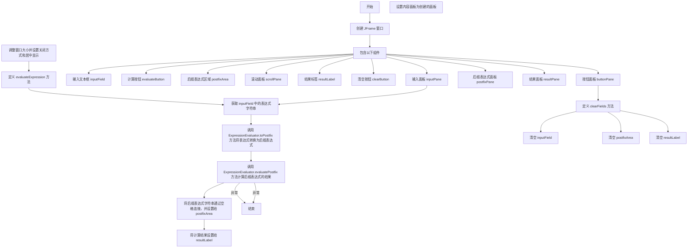

```mermaid
graph TD;
  1[开始];
  2[创建 JFrame 窗口];
  3[包含以下组件];
  3a[输入文本框 inputField];
  3b[计算按钮 evaluateButton];
  3c[后缀表达式区域 postfixArea];
  3d[滚动面板 scrollPane];
  3e[结果标签 resultLabel];
  3f[清空按钮 clearButton];
  3g[输入面板 inputPane];
  3h[后缀表达式面板 postfixPane];
  3i[结果面板 resultPane];
  3j[按钮面板 buttonPane];
  4[设置内容面板为创建的面板];
  5[调整窗口大小并设置关闭方式和居中显示];
  6[定义 evaluateExpression 方法];
  7[获取 inputField 中的表达式字符串];
  8[调用 ExpressionEvaluator.toPostfix 方法将表达式转换为后缀表达式];
  9[调用 ExpressionEvaluator.evaluatePostfix 方法计算后缀表达式的结果];
  10[将后缀表达式字符串通过空格连接，并设置给 postfixArea];
  11[将计算结果设置给 resultLabel];
  12[定义 clearFields 方法];
  13[清空 inputField];
  14[清空 postfixArea];
  15[清空 resultLabel];
  16[结束];

  1-->2;
  2-->3;
  3-->3a;
  3-->3b;
  3-->3c;
  3-->3d;
  3-->3e;
  3-->3f;
  3-->3g;
  3-->3h;
  3-->3i;
  3-->3j;
  3j-->12;
  3g-->7;
  7-->8;
  8-->9;
  9-->10;
  9--异常-->16;
  10-->11;
  9--异常-->16;
  12-->13;
  12-->14;
  12-->15;
  5-->6;
  6-->7;

```
